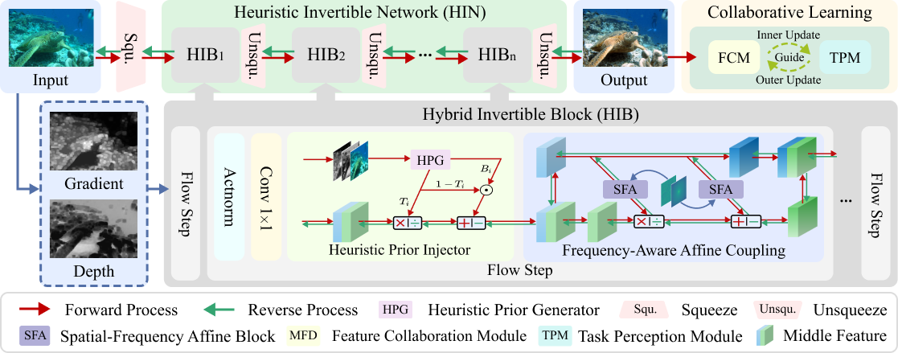

# HUPE
This is an implementation of the paper,
**“[HUPE: Heuristic Underwater Perceptual Enhancement with Semantic Collaborative Learning](https://link.springer.com/article/10.1007/s11263-024-02318-x)"**, 
Zengxi Zhang, Zhiying Jiang, Long Ma, Jinyuan Liu, Xin Fan, Risheng Liu*, 2025, International Journal of Computer Vision.

## Overview


## Download
Download the pre-trained model and put it in experiments/
- [Baidu Yun](https://pan.baidu.com/s/1YlPfizITieeoTCq_ex5k1Q) \
code:
​```
1ecu
​```
- [Google Drive](https://drive.google.com/file/d/1OWHoVwqyi0DMOtrJrPGv_1EDIX26CnoL/view?usp=drive_link)

## Quick Run
To test the pre-trained models for Underwater Enhancement on example images:

### Step 1: Generated priors from with underwater images:

run file 'IR_GDCP_forfolder.m' from root 'code/Generalization-of-the-Dark-Channel-Prior-for-Single-Image-Restoration-main/'

### Step 2: Generated enhancement images:
```
cd code
python test.py
```
## Contact
If you find our work useful in your research, please cite our paper:
```
@article{zhang2025hupe,
  title={HUPE: Heuristic Underwater Perceptual Enhancement with Semantic Collaborative Learning},
  author={Zhang, Zengxi and Jiang, Zhiying and Ma, Long and Liu, Jinyuan and Fan, Xin and Liu, Risheng},
  journal={International Journal of Computer Vision},
  pages={1--19},
  year={2025},
  publisher={Springer}
}

```
## Contact
Should you have any question, please contact [Zengxi Zhang].

[Zhiying Jiang]:cyouzoukyuu@gmail.com
